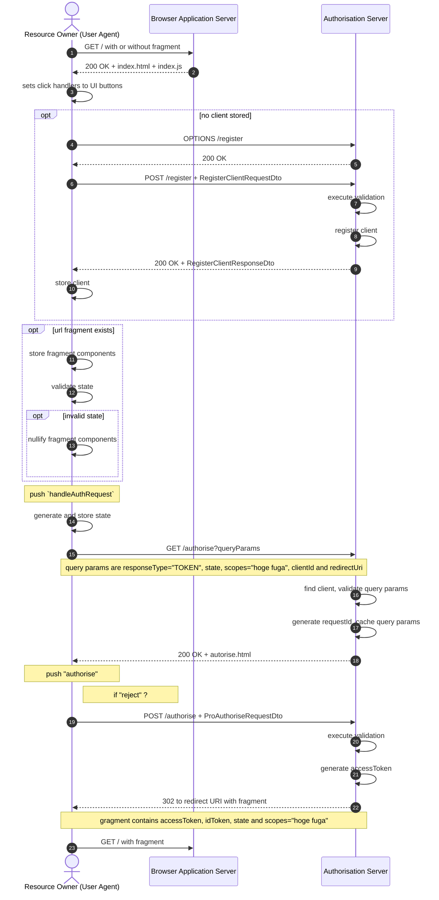

```mermaid
sequenceDiagram
autonumber

actor user as Resource Owner (User Agent)
participant app as Browser Application Server
participant auth as Authorisation Server

user->>app: GET / with or without fragment
app-->>user: 200 OK + index.html + index.js


user->>user: sets click handlers to UI buttons

opt no client stored
  user->>auth: OPTIONS /register
  auth-->>user: 200 OK
  user->>auth: POST /register + RegisterClientRequestDto
  auth->>auth: execute validation
  auth->>auth: register client
  auth-->>user: 200 OK + RegisterClientResponseDto
  user->>user: store client
end

opt url fragment exists
  user->>user: store fragment components
  user->>user: validate state
  opt invalid state
    user->>user: nullify fragment components
  end
end

note over user: push `handleAuthRequest`

user->>user: generate and store state
user->>auth: GET /authorise?queryParams
note over user, auth: query params are responseType="TOKEN", state, scopes="hoge fuga", clientId and redirectUri

auth->>auth: find client, validate query params
auth->>auth: generate requestId, cache query params
auth-->>user: 200 OK + autorise.html

note over user: push "authorise"
note right of user: if "reject" ?
user->>auth: POST /authorise + ProAuthoriseRequestDto

auth->>auth: execute validation
auth->>auth: generate accessToken
auth-->>user: 302 to redirect URI with fragment
note over user, auth: gragment contains accessToken, idToken, state and scopes="hoge fuga"

user->>app: GET / with fragment

```
