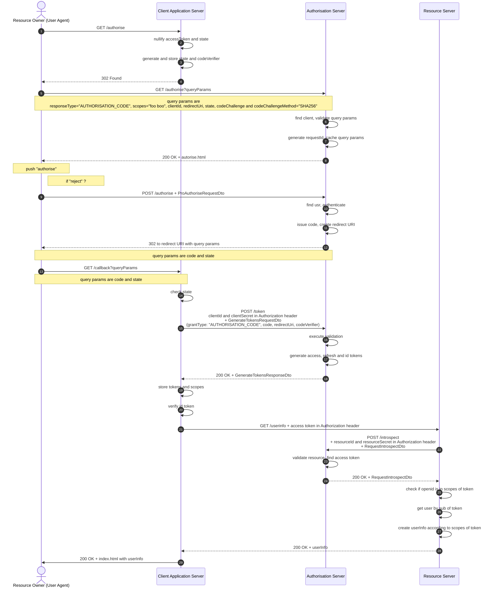

```mermaid
sequenceDiagram
autonumber

actor user as Resource Owner (User Agent)
participant app as Client Application Server
participant auth as Authorisation Server
participant res as Resource Server

user->>app: GET /authorise
app->>app: nullify accessToken and state
app->>app: generate and store state and codeVerifier
app-->>user: 302 Found
user->>auth: GET /authorise?queryParams
note over user, auth: query params are<br>responseType="AUTHORISATION_CODE", scopes="foo boo", clientId, redirectUri, state, codeChallenge and codeChallengeMethod="SHA256"
auth->>auth: find client, validate query params
auth->>auth: generate requestId, cache query params
auth-->>user: 200 OK + autorise.html

note over user: push "authorise"
note right of user: if "reject" ?
user->>auth: POST /authorise + ProAuthoriseRequestDto
auth->>auth: find usr, authenticate
auth->>auth: issue code, create redirect URI
auth-->>user: 302 to redirect URI with query params
note over user, auth: query params are code and state
user->>app: GET /callback?queryParams
note over user, app: query params are code and state
app->>app: check state
app->>auth: POST /token<br>clientId and clientSecret in Authorization header<br>+ GenerateTokensRequestDto<br>(grantType: "AUTHORISATION_CODE", code, redirectUri, codeVerifier)
auth->>auth: execute validation
auth->>auth: generate access, refresh and id tokens
auth-->>app: 200 OK + GenerateTokensResponseDto
app->>app: store tokens and scopes
app->>app: verify id token
app->>res: GET /userinfo + access token in Authorization header
res->>auth: POST /introspect<br>+ resourceId and resourceSecret in Authorization header<br>+ RequestIntrospectDto
auth->>auth: validate resource, find access token
auth-->>res: 200 OK + RequestIntrospectDto
res->>res: check if openid is in scopes of token
res->>res: get user by sub of token
res->>res: create userInfo according to scopes of token
res-->>app: 200 OK + userInfo
app->>user: 200 OK + index.html with userInfo

```
