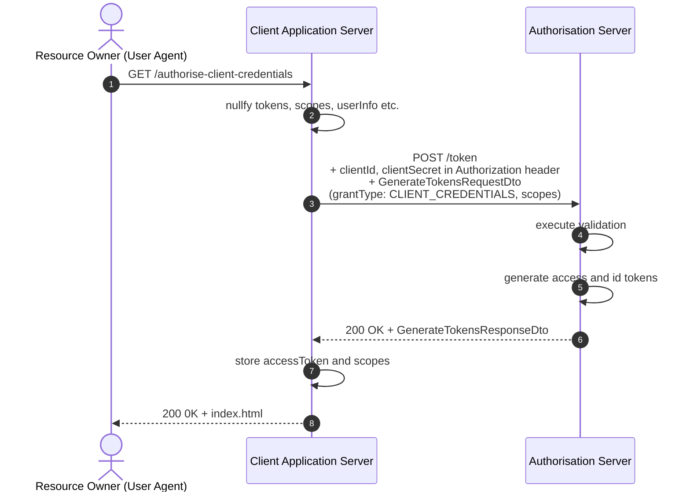

```mermaid
sequenceDiagram
autonumber

actor user as Resource Owner (User Agent)
participant app as Client Application Server
participant auth as Authorisation Server

user->>app: GET /authorise-client-credentials
app->>app: nullfy tokens, scopes, userInfo etc.
app->>auth: POST /token<br>+ clientId, clientSecret in Authorization header<br>+ GenerateTokensRequestDto<br>(grantType: CLIENT_CREDENTIALS, scopes)
auth->>auth: execute validation
auth->>auth: generate access and id tokens
auth-->>app: 200 OK + GenerateTokensResponseDto
app->>app: store accessToken and scopes
app-->>user: 200 0K + index.html

```
