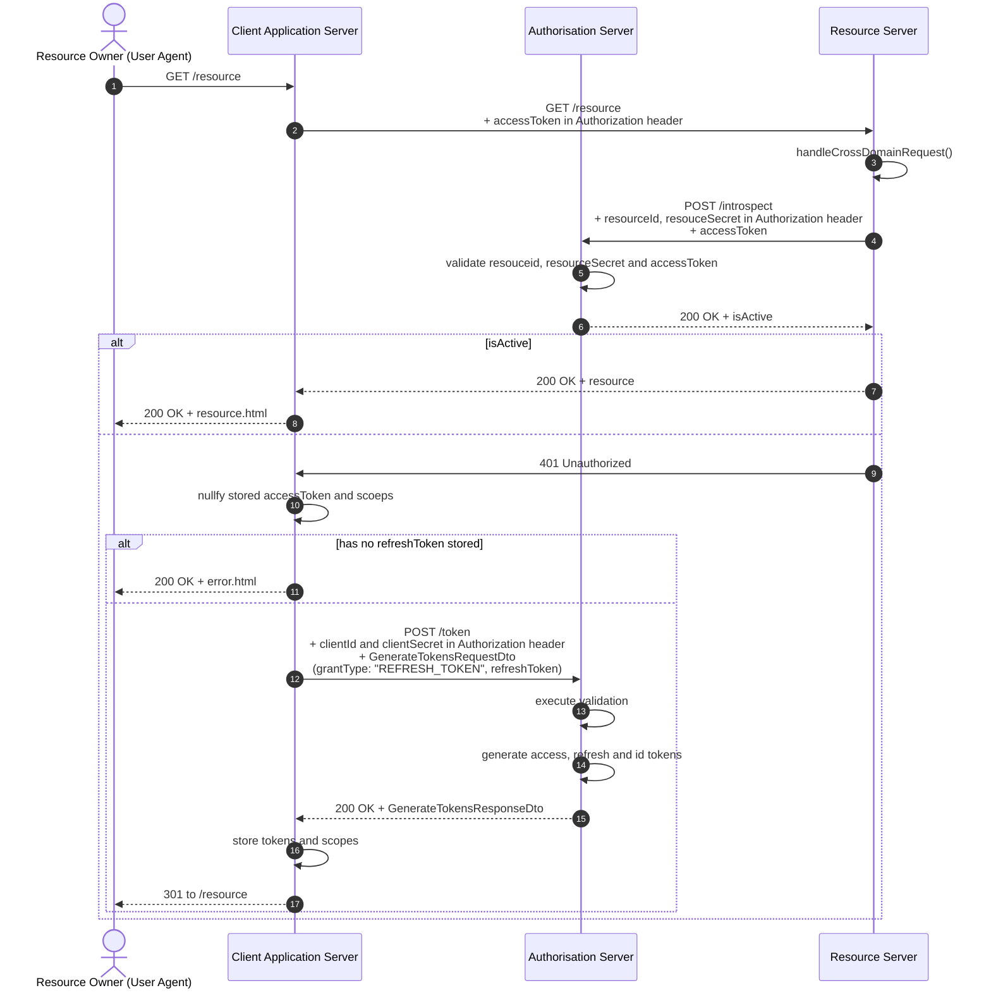

```mermaid
sequenceDiagram
autonumber

actor user as Resource Owner (User Agent)
participant app as Client Application Server
participant auth as Authorisation Server
participant res as Resource Server

user->>app: GET /resource
app->>res: GET /resource<br>+ accessToken in Authorization header
res->>res: handleCrossDomainRequest()
res->>auth: POST /introspect<br>+ resourceId, resouceSecret in Authorization header<br>+ accessToken
auth->>auth: validate resouceid, resourceSecret and accessToken
auth-->>res: 200 OK + isActive

alt isActive
res-->>app: 200 OK + resource
app-->>user: 200 OK + resource.html

else
res->>app: 401 Unauthorized
app->>app: nullfy stored accessToken and scoeps

alt has no refreshToken stored
app-->>user: 200 OK + error.html
else
app->>auth: POST /token<br>+ clientId and clientSecret in Authorization header<br>+ GenerateTokensRequestDto<br>(grantType: "REFRESH_TOKEN", refreshToken)
auth->>auth: execute validation
auth->>auth: generate access, refresh and id tokens
auth-->>app: 200 OK + GenerateTokensResponseDto
app->>app: store tokens and scopes
app-->>user: 301 to /resource
end

end

```
