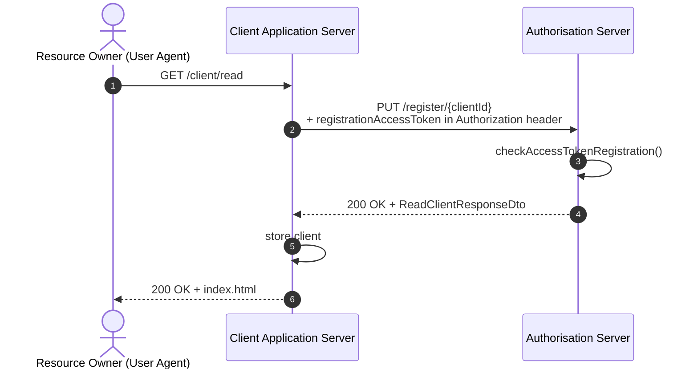

```mermaid
sequenceDiagram
autonumber

actor user as Resource Owner (User Agent)
participant app as Client Application Server
participant auth as Authorisation Server

user->>app: GET /client/read

app->>auth: PUT /register/{clientId}<br>+ registrationAccessToken in Authorization header
auth->>auth: checkAccessTokenRegistration()
auth-->>app: 200 OK + ReadClientResponseDto
app->>app: store client
app-->>user: 200 OK + index.html

```
