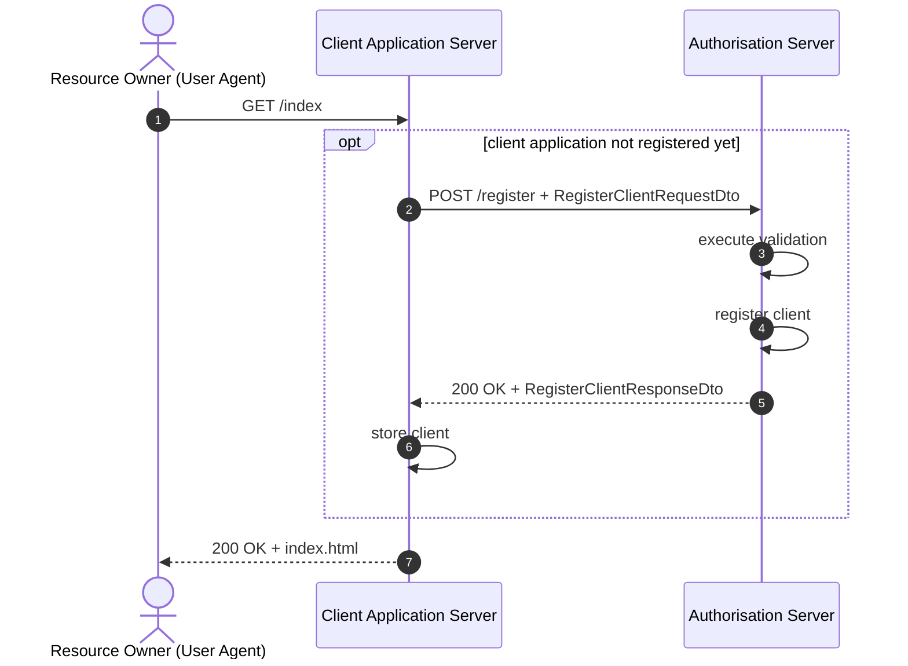

```mermaid
sequenceDiagram
autonumber

actor user as Resource Owner (User Agent)
participant app as Client Application Server
participant auth as Authorisation Server

user->>app: GET /index

opt client application not registered yet
  app->>auth: POST /register + RegisterClientRequestDto
  auth->>auth: execute validation
  auth->>auth: register client
  auth-->>app: 200 OK + RegisterClientResponseDto
  app->>app: store client
end

app-->>user: 200 OK + index.html

```
