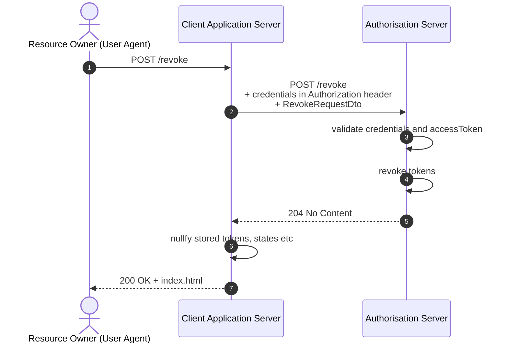

```mermaid
sequenceDiagram
autonumber

actor user as Resource Owner (User Agent)
participant app as Client Application Server
participant auth as Authorisation Server

user->>app: POST /revoke
app->>auth: POST /revoke<br>+ credentials in Authorization header<br>+ RevokeRequestDto
auth->>auth: validate credentials and accessToken
auth->>auth: revoke tokens
auth-->>app: 204 No Content
app->>app: nullfy stored tokens, states etc
app-->>user: 200 OK + index.html
```
