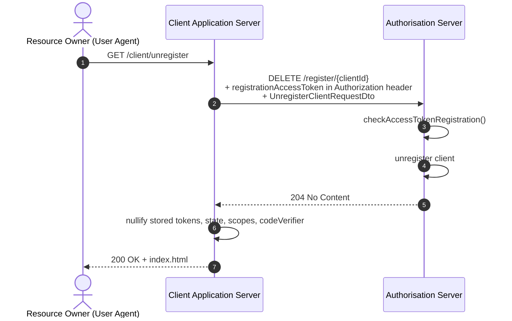

```mermaid
sequenceDiagram
autonumber

actor user as Resource Owner (User Agent)
participant app as Client Application Server
participant auth as Authorisation Server

user->>app: GET /client/unregister

app->>auth: DELETE /register/{clientId}<br>+ registrationAccessToken in Authorization header<br> + UnregisterClientRequestDto
auth->>auth: checkAccessTokenRegistration()
auth->>auth: unregister client
auth-->>app: 204 No Content
app->>app: nullify stored tokens, state, scopes, codeVerifier
app-->>user: 200 OK + index.html

```
