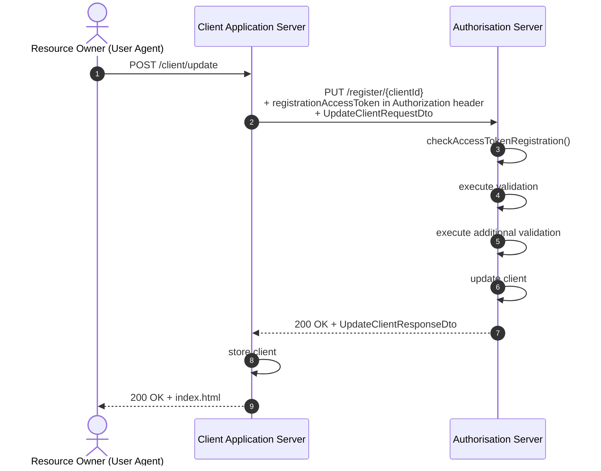

```mermaid
sequenceDiagram
autonumber

actor user as Resource Owner (User Agent)
participant app as Client Application Server
participant auth as Authorisation Server

user->>app: POST /client/update

app->>auth: PUT /register/{clientId}<br>+ registrationAccessToken in Authorization header<br> + UpdateClientRequestDto
auth->>auth: checkAccessTokenRegistration()
auth->>auth: execute validation
auth->>auth: execute additional validation
auth->>auth: update client
auth-->>app: 200 OK + UpdateClientResponseDto
app->>app: store client
app-->>user: 200 OK + index.html

```
